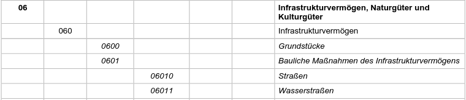
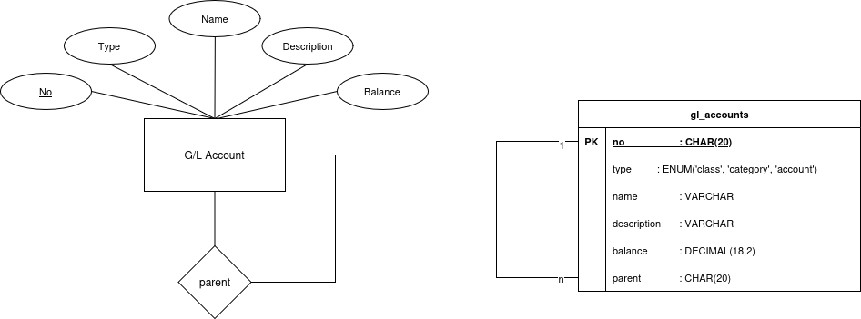

# Kontenplan

Web-basierte Anwendung zur Erstellung und Verwaltung eines beliebigen Kontenplans zu Buchhaltungszwecken.

## Ziel
Es soll ein Kontenplan erstellt werden können, der Konten unter einer Kontenklasse einordnet. Zwischen Konten und Kontenklassen sollen Kontenkategorien beliebig tief geschachtelt werden können.

Hier ist ein beispielhafter Auszug aus einem Kontenplan, der durch die Software abgebildet werden soll.

## Datenmodell

Zunächst soll eine Minimalimplementierung erfolgen.

## Umsetzung

Es sollen möglichst alle Regeln, die die Datenstrukturen betreffen, bereits auf der Datenbankebene sichergestellt werden.
Dazu kommen Trigger zum Einsatz, wie in folgendem Beispiel gezeigt:

    DELIMITER $$

    CREATE TRIGGER trg_gl_before_insert
    BEFORE INSERT ON gl_accounts
    FOR EACH ROW
    BEGIN
        IF CHAR_LENGTH(NEW.no) > 1 THEN
            SET NEW.parent_no = LEFT(NEW.no, CHAR_LENGTH(NEW.no) -1);
            SET New.type = 'account';
        ELSE
            SET NEW.type = 'class';
        END IF;
    END
    
    DELIMITER ;
